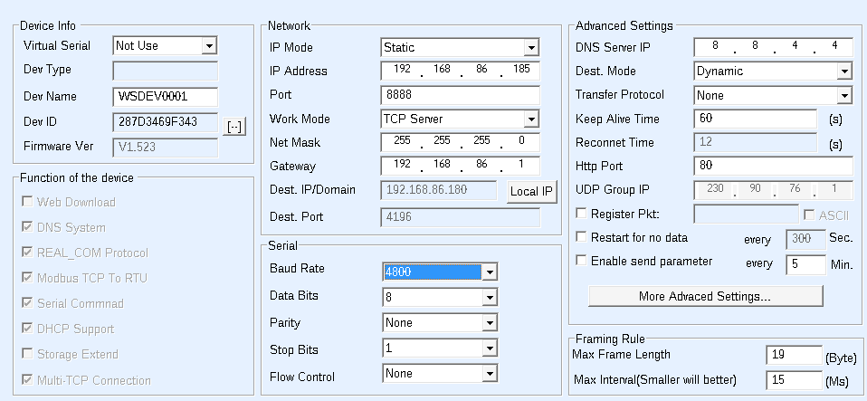

# Midea / Senville S-Comms (S1S2) Monitor

Reverse engineering and monitoring tools for the S-Comms (S1S2) communication bus used by Midea-based inverter HVAC systems (including Senville central air units).

This project passively monitors and decodes the communication between the indoor air handler and outdoor inverter unit, exposing internal telemetry — compressor behavior, temperatures, voltages, EXV position, and more — and streams those metrics into Home Assistant via MQTT.

> **Note:** This project is observation-only. It does not send commands or control the HVAC system.

[Home Assistant Discussion Thread](https://community.home-assistant.io/t/reverse-engineering-senville-midea-scomms/992233?u=midatrix)

---

## Requirements

- Python 3.10+
- Waveshare RS485-to-Ethernet adapter (or equivalent RS485 bridge)
- Passive tap on the S1/S2 communication lines
- Home Assistant with an MQTT broker (optional)

Install Python dependencies inside a virtual environment:

```bash
python3 -m venv venv
source venv/bin/activate        # Linux / macOS
# venv\Scripts\activate         # Windows

pip install -r requirements.txt
```

---

## Configuration

Edit `src/config.py` before running:

```python
# Network bridge IP/port (Waveshare adapter)
WAVESHARE_IP   = "192.168.x.x"
WAVESHARE_PORT = 8888

# Home Assistant MQTT broker
MQTT_IP          = "192.168.x.x"
MQTT_PORT_NUMBER = 1883
MQTT_USER        = "your_mqtt_username"
MQTT_PASS        = "your_mqtt_password"

# SQLite output directory
SQLITE_DB_DIR = "/var/lib/midea_telemetry"
```

---

## How to Run

```bash
# From the project root
python3 -m src.main
```

---

## Project Structure

```
src/
├── main.py                  # Main event loop — TCP connection, frame dispatch
├── config.py                # All user configuration (IPs, credentials, paths)
├── serial/
│   └── frame_buffer.py      # RS485 byte stream → validated frame slices
├── protocol/
│   └── validator.py         # CRC-16/MODBUS frame validation
├── decode/
│   └── sensors.py           # Frame payload → decoded sensor values
├── ha/
│   └── discovery.py         # Home Assistant MQTT discovery + state publishing
└── database/
    └── db_handler.py        # SQLite frame logging with daily rotation
data/
└── bus_noise.log            # Bytes that didn't match any known frame signature
```

---

## Project Goals

- Document the S-Comms (S1S2) protocol structure
- Capture and analyze RS485 traffic
- Validate CRC-16/MODBUS frame integrity
- Identify sensor fields and scaling factors
- Monitor real inverter performance metrics
- Integrate telemetry into Home Assistant

---

## Sensor Reference

All byte indices are **payload-relative** (byte 5 of the raw frame = index 5, matching the DB column names HPA5, ODU5, etc).

### Confidence Levels
- ✅ **Confirmed** — Validated against physical measurements or unambiguous observed behaviour
- ⚠️ **Probable** — Formula fits data well, physically plausible, not yet ground-truthed
- ❓ **Unknown** — Captured but meaning not yet decoded

---

### Frame `0100_20` — IDU Core (Indoor Unit → ODU)

| Byte | Sensor Name | Formula | Unit | Confidence | Notes |
|------|-------------|---------|------|------------|-------|
| 6 | `IDU_Mode` | enum map | — | ✅ | 0x00=Off, 0x01=Cool, 0x02=Heat, 0x03=Fan, 0x04=Dry |
| 7 | `IDU_Demand_Hz` | `raw` | Hz | ✅ | IDU's requested compressor frequency. Proportional to (T1_room − setpoint) delta. Confirmed range 0–96 Hz |
| 11 | `Target_Setpoint` | `raw` | °C | ✅ | User setpoint in °C, no offset or scaling needed |
| 12 | `IDU_Blower_Speed` | enum map | — | ✅ | 0x01=High, 0x02=Medium, 0x03=Low, 0x06=Boost, 0x0F=Auto |
| 13 | `T1_Room_Temp` | `(raw − 61) / 2` | °C | ⚠️ | Indoor ambient temperature, unverified against a reference thermometer |
| 14 | `T2_IDU_Coil_Temp` | `(raw − 61) / 2` | °C | ⚠️ | Indoor evaporator/condenser coil temperature, unverified against a reference thermometer |

---

### Frame `0001_20` — ODU Core (ODU → IDU)

| Byte | Sensor Name | Formula | Unit | Confidence | Notes |
|------|-------------|---------|------|------------|-------|
| 6 | `Compressor_Actual_Hz` | `raw` | Hz | ✅ | Real-time running frequency. Smooth ramp, confirmed 0–80 Hz observed |
| 9 | `T3_ODU_Coil_Temp` | `(raw − 61) / 2` | °C | ⚠️ | Outdoor coil temperature. Goes strongly negative when iced (defrost trigger visible in data), unverified against a reference thermometer |
| 10 | `T4_Outdoor_Temp` | `(raw × 0.33) − 13.26` | °C | ⚠️ | Outdoor ambient. Formula origin unknown — results are physically plausible but unverified against a reference thermometer and need to include the quater degree b[15] |
| 11 | `TP_Discharge_Temp` | `raw / 2` | °C | ⚠️ | Compressor discharge line temperature |
| 12 | `Compressor_Actual_Amps` | `raw / ?` | A | ⚠️ | Divisor unconfirmed. Raw peaks at ~30 at 80 Hz defrost. Needs clamp meter validation at high load |
| 13 | `ODU_Unknown_B13` | `raw` | — | ❓ | Narrow range (177–185), stable. Possibly resistance |
| 14 | `ODU_Mode` | enum map | — | ✅ | 0x00=Off, 0x01=Cool, 0x02=Heat, 0x03=Fan, 0x04=Dry, 0x07=Defrost |

---

### Frame `0001_50` — ODU Performance A (HPA)

| Byte | Sensor Name | Formula | Unit | Confidence | Notes |
|------|-------------|---------|------|------------|-------|
| 11 | `ODU_Fan_Speed_Actual_RPM` | `raw × 8` | RPM | ✅ | Outdoor fan actual speed. Zero during defrost (fan off confirmed) |
| 12 | `ODU_DC_Bus_Voltage_Actual` | `raw` | V | ✅ | Rectified DC bus, actual measured value |
| 14 | `AC_Input_Voltage` | `raw` | V | ✅ | Mains input voltage. Observed 179–207 V, consistent with US 240 V supply variation |
| 15 | `Inverter_DC_Bus_Voltage` | `raw` | V | ✅ | Inverter-side DC rail, ~134–170 V (rectified from 120 V leg) |
| 16 | `IPM_Load_Index` | `raw` | — | ⚠️ | Tracks compressor Hz nearly 1:1. Not average amps despite original label. Likely a normalised load or duty index reported by the IPM module |

---

### Frame `0001_51` — ODU Performance B (HPB)

| Byte | Sensor Name | Formula | Unit | Confidence | Notes |
|------|-------------|---------|------|------------|-------|
| 5 | `ODU_Fan_Speed_Target_RPM` | `raw × 8` | RPM | ✅ | Outdoor fan target speed |
| 6 | `ODU_DC_Bus_Voltage_Target` | `raw` | V | ✅ | DC bus target setpoint |
| 11 | `Run_Minutes_Clock` | `raw` | min | ⚠️ | Compressor run-time minutes component |
| 12 | `Run_Hours_Clock` | `(raw × 256) / 60` | min | ⚠️ | Compressor run-time hours component. Combined with byte 11 for total runtime |

---

### Frame `0001_52` — ODU Performance C (HPC)

| Byte | Sensor Name | Formula | Unit | Confidence | Notes |
|------|-------------|---------|------|------------|-------|
| 7 | `IPM_Heatsink_Temp_1` | `raw` | °C | ⚠️ | No offset/scaling — raw value appears to be °C directly. Varies with ambient (17–20 °C on mild days). Lower of the two heatsink probes |
| 8 | `IPM_Heatsink_Temp_2` | `raw` | °C | ⚠️ | Same as above, consistently ~8 °C warmer than Temp_1. Likely a second probe on the same IPM heatsink |
| 9 | `Compressor_PID_Step` | signed int8 | — | ⚠️ | Two's complement signed byte. `+7` = aggressive ramp-up (soft-start only). `0` = compressor off. `−1` = steady-state trim. `−2` = active decel / thermal protection (only seen at high load with rising discharge temp) |
| 10 | `IPM_Phase_Current_A` | `raw` | A | ⚠️ | IPM module phase current feedback, primary measurement. Raw units — divisor unconfirmed pending clamp meter. Monotonically tracks load: ~4 at 15 Hz, ~9 at 48 Hz, ~13 at 80 Hz defrost |
| 11 | `IPM_Phase_Current_B` | `raw` | A | ⚠️ | Secondary phase current, consistently ~0.7× of Phase A across all operating points. Likely a different shunt or phase winding measurement on the same IPM |
| 13 | `ODU_Fan_Speed_Step` | `raw` | — | ✅ | Fan speed gear index (integer step, not RPM). Correlates with RPM bands |

---

### Frame `0001_53` — ODU Performance D (HPD)

| Byte | Sensor Name | Formula | Unit | Confidence | Notes |
|------|-------------|---------|------|------------|-------|
| 6 | `Phase_Modifier` | `raw if raw <= 127 else raw - 256` | — | ⚠️ | Acts as a negative logic flag, an inverted bitmask, or a countdown timer modifier that tells the system what sub-state the current phase is in
| 7 | `Routine_Phase_Step` | `raw` | — | ⚠️ | Compressor startup/ramp phase index. Values 0–4 observed at idle/shutdown, higher values during active ramp sequences |
| 8 | `Active_Ramp_Routine` | `raw` | — | ⚠️ | Non-zero during oil return or high-load ramp events |
| 11+12 | `EXV_Position_Steps` | `(byte12 × 256) + byte11` | steps | ✅ | Electronic expansion valve position. 16-bit little-endian. Range ~75 steps (idle) to ~4200 steps (full defrost). Responds correctly to load changes |
| 13 | `ODU_Target_Hz` | `raw` | Hz | ✅ | ODU's internal PID frequency target. Leads `Compressor_Actual_Hz`. Jumps to 25 Hz at soft-start, then tracks IDU demand. Observed ceiling: 80 Hz during defrost, ~48–58 Hz during normal heating |

---

## Protocol Specification

### Bus Parameters

| Parameter | Value |
|---|---|
| Baud Rate | 4800 |
| Data Bits | 8 |
| Parity | None |
| Stop Bits | 1 |
| Interface | RS485 half-duplex |

### Frame Structure (A0 frames)

```
[A0] [DD DD] [CC] [LL] [ ... PAYLOAD ... ] [CR CR] ([00])
  0    1  2    3    4     5 .. 5+LL-1        -3  -2    -1
```

| Bytes | Field | Notes |
|---|---|---|
| 0 | Header | `0xA0` |
| 1–2 | Device address | `0x0001` = ODU, `0x0100` = IDU |
| 3 | Message ID | `0x20`, `0x50`–`0x53`, etc. |
| 4 | Payload length | Number of data bytes that follow |
| 5..N | Payload | Sensor data |
| N+1–N+2 | CRC | CRC-16/MODBUS, little-endian |
| N+3 | Padding | `0x00` — present only on `direction 01` frames |

### Checksum

| Parameter | Value |
|---|---|
| Algorithm | CRC-16/MODBUS |
| Polynomial (reflected) | `0xA001` |
| Initial value | `0xFFFF` |
| Bit order | LSB-first (reflected) |
| Output | 2 bytes, little-endian |

### Message Cycle

Captured traffic shows a repeating exchange between ODU and IDU:

```
20 → 21 → 20 → 50 → 20 → 51 → 20 → 52 → 20 → 53 → 20 → 91
```

Message `20` is a high-frequency core telemetry frame. The `50`–`53` series rotates through extended diagnostic data.

### Example Captures

```
13:51:42.853  ODU (0001)  ID:20  A00001200C120F000077742604B5010001001D51
13:51:42.946  IDU (0100)  ID:20  A00100200C11010F000000170F6C60190000E7B400
```

---

## Home Assistant Integration

Parsed telemetry is published to Home Assistant via MQTT discovery. Sensors appear automatically under a `Senville Heat Pump` device in the HA device registry.

The publisher uses send-on-change logic with a 60-second heartbeat to keep values fresh without flooding the broker.

**Example metrics visible in HA:**

- Compressor Hz (actual vs. target)
- EXV position
- Bus voltage (AC in, DC bus, inverter)
- All temperature sensors
- Fan RPM (actual vs. target)
- PID error terms
- Runtime clock

---

## Database Logging

Frames are logged to a daily-rotating SQLite database under `SQLITE_DB_DIR`. A `latest.db` symlink is maintained for easy Grafana integration.

Each row captures a complete message cycle — one snapshot of all six frame types combined — timestamped at the moment the cycle completes.

---

## Hardware

| Component | Purpose |
|---|---|
| Waveshare RS485-to-Ethernet | Passive bus tap via TCP stream |
| S1/S2 HVAC wires | RS485 differential pair |

> **⚡ Bus Voltage — Important:** On this system the S1/S2 lines run at **5V**. This is specific to central air configurations where the indoor and outdoor units have **separate mains power supplies**. Most mini-split and single-power-supply units run their S-Comms bus at significantly higher voltages. Do not assume 5V — always measure before connecting any interface hardware.



---

## ⚠️ Safety Notice

HVAC inverter systems may expose mains voltage on communication terminals depending on system design. Improper probing of HVAC control boards can result in serious injury, equipment damage, or voided warranties.

This project was developed on a **central air unit where the indoor and outdoor units are on separate mains circuits**. This is why the S1/S2 bus on this system measures at **5V**. Many other Midea-based systems — particularly mini-splits where both units share a single power supply — run their S-Comms bus at much higher voltages and may present hazardous potentials on those same terminals.

**Always measure bus voltage and verify electrical conditions before connecting any interface hardware.**

---

## Contributing

If you're working with Midea or Senville inverter systems and have additional frame captures, sensor mappings, or scaling corrections, contributions are welcome. Open an issue or pull request.

---

## License

MIT License
